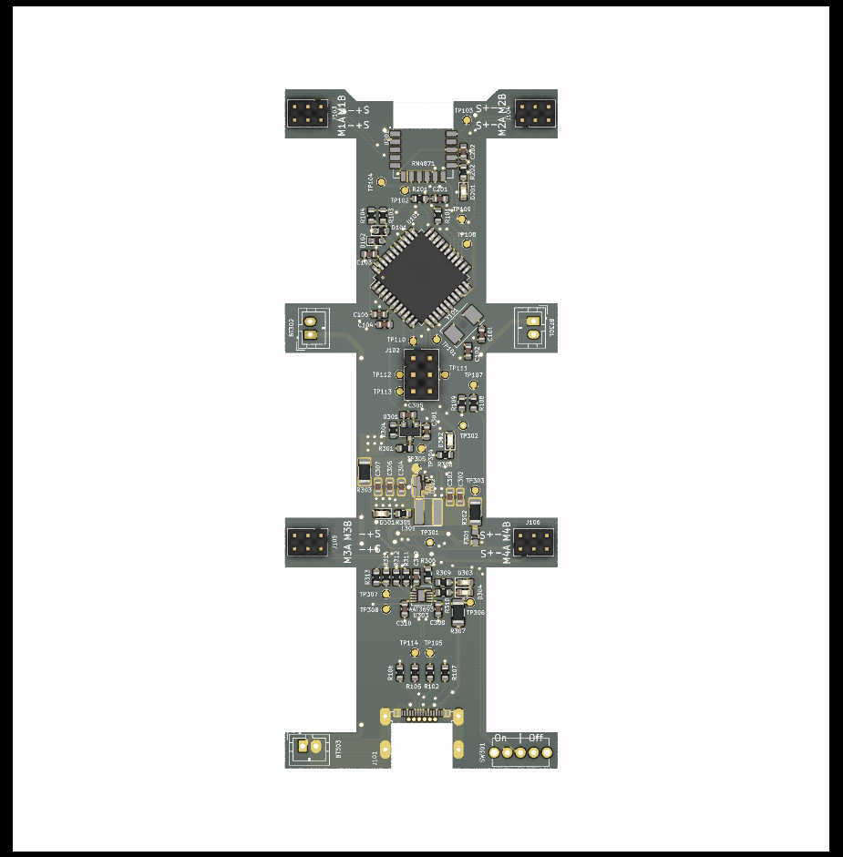

# Phonebot Board

For detailed information on how to assemble PhoneBot, see the [electrical getting started](https://github.com/vi-robotics/phonebot_docs/blob/main/electrical/getting_started.md).

KiCad project for Phonebot electrical schematics and layout. There are two boards for PhoneBot

- [Main Board](main_board)
  - Contains the BLE coms module, AtMEGA32u4, and servo drivers
- [Servo Board](servo_board)
  - Convenience board to make servos replaceable without soldering on the main board

Design documents are availiable for the current release.

- [Schematics](figs/Schematics.pdf)
- [Layout](figs/Layout.pdf)
